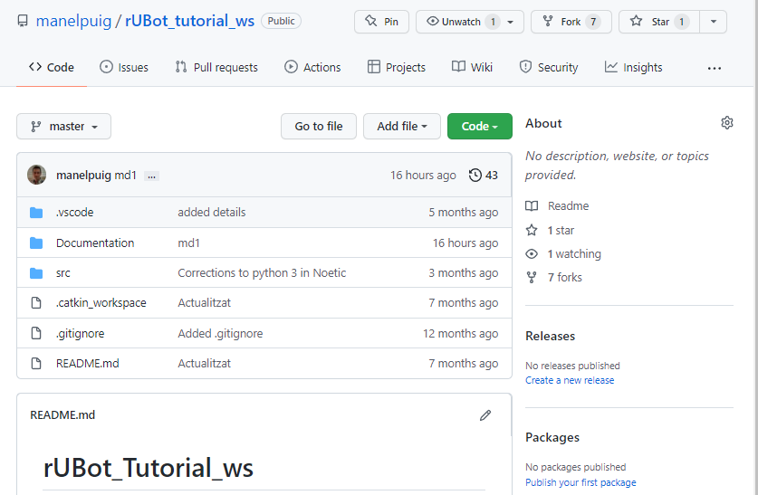

# **rUBot_Tutorial_ws**
This is a first tutorial to learn ROS basics.

First of all we will learn how to install the ROS in your computer.

## **1. ROS Installation & Tools**
Installation will be made using Docker:

- https://docs.docker.com/get-docker/

In windows:
- https://docs.docker.com/desktop/install/windows-install/

    >   Open PowerShell terminal and type: systeminfo | find "Tipo de sistema"
    >
    >   The output has to be: x64-based PC

- Then you have to complete your installation with WSL 2 for kernell update in: https://learn.microsoft.com/ca-es/windows/wsl/install-manual#step-4---download-the-linux-kernel-update-package
- Stablish WSL2 as default by opening a powershell and typing: wsl --set-default-version 2
- restart your computer

### **1.1 ROS1 Images**

Official images are:
- ROS Noetic: osrf/ros:noetic-desktop-full
- Open PowerShell and type: 
```shell
docker pull osrf/ros:noetic-desktop-full
```
To create a Container with GUI and folder share, open a terminal and type:
```shell
docker run --name ROS1_Noetic_share -e DISPLAY=host.docker.internal:0.0 --mount src="C:\Users\HP\OneDrive\Escritorio\ROS\shared_folder",dst=/home/myDocker_shared,type=bind -it ros1_noetic_mpuig:latest
```

## **2. Prepare your Workspace**
Once you are in the ROS Noetic Virtual machine, you can:
- create your own workspace
- Use an existing workspace

### **2.1 Create your own workspace**
This is the best option to learn ROS. You will create a new repository and you will follow the instructions to create all the packages to fulfill the objectives and functionalities.

- In your github account, create a new public repository
- add gitignore with ROS option


### **2.2 Use an existing workspace**
You can also use our repository and make your modifications according to the exercises we will propose you. 
In that case, you can follow the instructions:

- Fork the "rubot_tutorial_ws" repository from my github


- Open your Docker container with ROS Noetic and clone your forked directory in your Desktop (copy the exact url to your forked repository)

    ```shell
    git clone https://github.com/yourusername/rUBot_tutorial_ws
    ```
    
- Compile:
```shell
cd ~/rubot_tutorial_ws
catkin_make
```
- Open .bashrc file (from root)
```shell
gedit ~/.bashrc
```
- Ensure that you have the last 2 lines (review the exact name of your repository):
```xml
source /opt/ros/noetic/setup.bash
source ~/rUBot_tutorial_ws/devel/setup.bash
cd /home/ubuntu/rubot_tutorial_ws
```
- You are ready to work with your repository for this session

When finished, **syncronize** the changes with your github. 
- Using github web editor
- using github Desktop