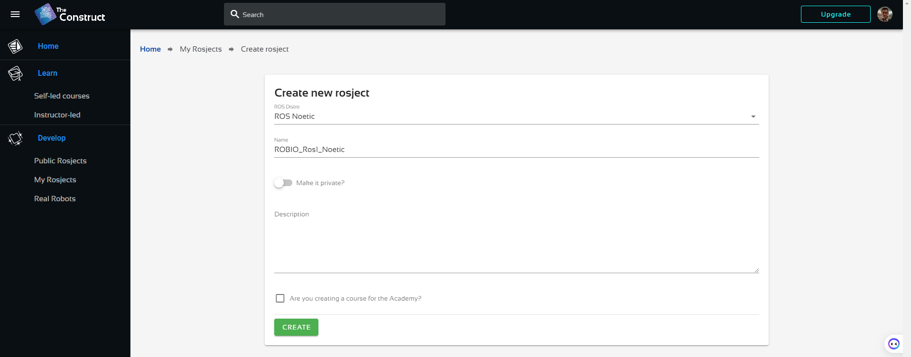
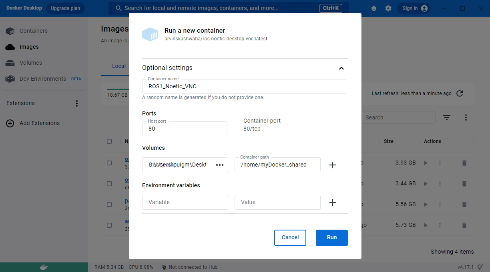
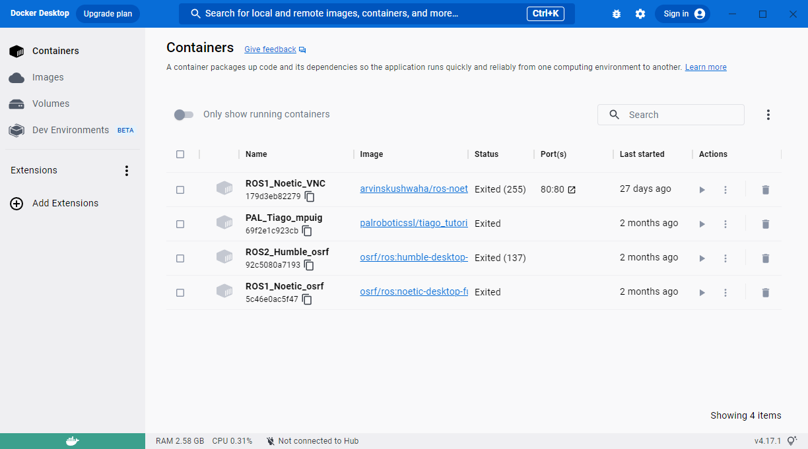
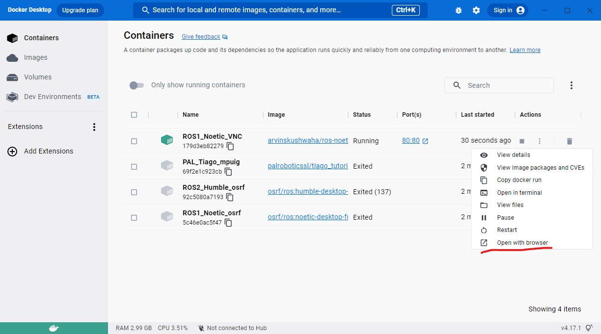
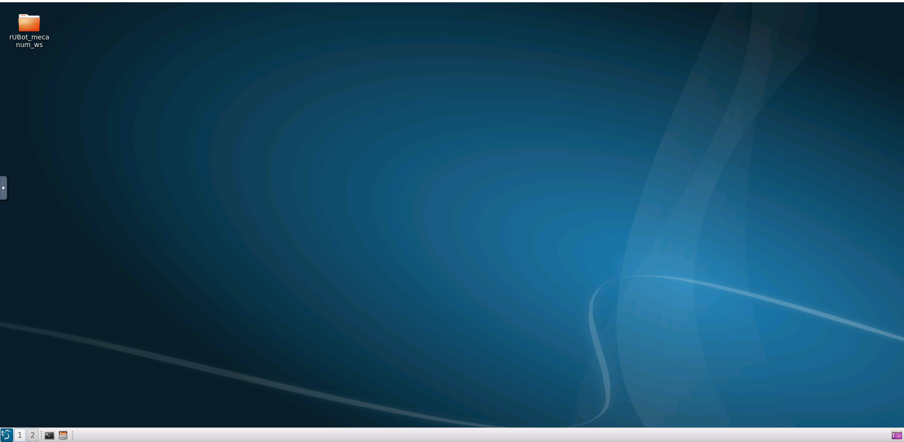

# **1. ROS environment setup**

First of all we will learn how to work within a ROS environment. You will have to choose between 3 possibilities:
- use a 3rd party open ROS environment (recommended)
- use a Docker utility
- use a Virtual machine with virtual box

## **1.1 Use open ROS environment**

You can use the ROS environment developed by "The Construct" (https://app.theconstructsim.com/), enterprise working on ROS academia and development and located in Barcelona.
- Open the link: https://app.theconstructsim.com/
- Create a free user account
- Select "myRosjects"

- Create a New Project

You will have 2GB Virtual machine with Ubuntu 20 and ROS Noetic installed for free!!


## **1.2 ROS Installation using Docker utility**
Installation instructions could be found in: https://docs.docker.com/desktop/

Some other interessant links could be found:
- http://wiki.ros.org/docker
- http://wiki.ros.org/docker/Tutorials/Docker

You have to install:

**a) Docker for windows:** an easy to install application that enables you to manage your containers (https://docs.docker.com/desktop/install/windows-install/)

* Then you have to complete your installation with WSL 2 for kernell update in: https://learn.microsoft.com/ca-es/windows/wsl/install-manual#step-4---download-the-linux-kernel-update-package
* Stablish WSL2 as default by opening a powershell and typing: wsl --set-default-version 2
* restart your computer

**b) X11 display server**: Xming X server for Windows (https://sourceforge.net/projects/xming/), and XQuartz for macOS (https://www.xquartz.org/index.html). That will allow you to visualize, in particular the RViZ robot visualization and tools and the Gazebo simulation of the robot.

**c)** **Visual Studio Code** (https://code.visualstudio.com/)

### **1.2.1 ROS Images**

#### **a) Using official images** 

These images are mantained by Open Source Robotics Foundation (OSRF).

You can find them in:
- https://registry.hub.docker.com/_/ros/
- https://hub.docker.com/r/osrf/ros/tags

Open PowerShell and type:

```shell
docker pull osrf/ros:noetic-desktop-full
or
docker pull osrf/ros:humble-desktop-full
```

To create a Container (choose proper name) with GUI and folder share (select your src absolute location), open a terminal and type:

```shell
docker run --name ROS1_Noetic_osrf -e DISPLAY=host.docker.internal:0.0 --mount src="C:\Users\puigm\Desktop\ROS_github\myPC_shared",dst=/home/myDocker_shared,type=bind -it osrf/ros:noetic-desktop-full
or
docker run --name ROS2_Humble_osrf -e DISPLAY=host.docker.internal:0.0 --mount src="C:\Users\puigm\Desktop\ROS_github\myPC_shared",dst=/home/myDocker_shared,type=bind -it osrf/ros:humble-desktop-full
```

**Graphical interface**

For graphical interface, in **windows** open Xlaunch:

- First choose “Multiple windows” and set to 0 the "Display number”
- Then, set “Start no client” in the second screen
- In the third screen, click “Clipboard” and "Primary Selection", unclick "Native opengl" and click "Disable access control"
- And just click “Finalize” in the last screen

For graphical interface in **Mac os**:

To forward X11 GUI applications from a Docker container to a macOS host, you can follow these steps:
 - Install last version of XQuartz (https://www.xquartz.org/)
 - Go to "Preferences" > "Security" and make sure the "Allow connections from network clients" option is enabled.
 - enable X11 forwarding and provide the necessary environment variables:
 ```shell
 docker run -e DISPLAY=host.docker.internal:0 --net=host -it --rm ubuntu xeyes
```
Once the container is running, you can launch GUI applications from the container's command line, and they should appear on the macOS host's XQuartz server.

**VS Code as working tool**

We will use VS Code to sync a copy of your github repository.

- Install VS Code following instructions in document "InstallCode.doc"

- Run the docker container
- Open Visual Studio Code and Install the extensions:

    - Docker from Microsoft
    - Dev Containers from Microsoft
    - Git Extension Pack (when you are connected with container)

- Connect the container to VS Code:
    - from left-side menu choose Docker
    - right-click on the running container and select "Attach VS Code"
- Update your docker Container:
```shell
apt update
```

Install some functionalities you will need:

```shell
apt install -y git && apt install -y python3-pip
```
- Re-start the container


#### **b) Using images with preinstalled graphical interface** 

For ROS_Noetic we can find:
 https://hub.docker.com/r/arvinskushwaha/ros-noetic-desktop-vnc/tags
- Open a terminal in your computer and type:
```shell
docker pull arvinskushwaha/ros-noetic-desktop-vnc:latest
```
- Verify the Docker desktop the image installed. 

- Run The image with the following options:

- Verify the Docker containers created:

- Run the container in Docker Desktop
- Select in 3-dot menu the option "Open with browser"

- A new window appear in your web browser with the graphical interface:


You will have now a graphical interface working and faster than using XLaunch or XQuark


## **1.3 ROS Installation using Virtual machine with ROS**
You can always install a ROS virtual machine with Virtual Box for MAC
- Download Virtual Box for windows/macOS systems (https://www.virtualbox.org/wiki/Downloads)
- Install Virtual Box in your computer
- Download the ROS virtual machine in this link:
- and Add this ROS virtual machine choosing file-->Import appliance (and follow instructions)

You will have a ready to use ROS environment

# **2. Prepare your Workspace**

Once you are in the ROS Noetic environment, you can:

- create your own workspace
- Use an existing workspace

## **2.1 Create your own workspace**

This is the best option to learn ROS. You will create a new repository and you will follow the instructions to create all the packages to fulfill the objectives and functionalities.

- In your github account:
  - create a new public repository
  - add gitignore with ROS option

- In your docker container (within VS Code):
  - Clone your new created repository in /home folder
  - compile 

## **2.2 Use an existing workspace**

You can also use our repository and make your modifications according to the exercises we will propose you.
In that case, you can follow the instructions:

- Fork the "rubot_tutorial_ws" repository from my github
  
- Open your ROS Noetic environment
- Clone your forked directory in your home directory of container
  ```shell
  git clone https://github.com/yourusername/rUBot_tutorial_ws
  ```
- Open .bashrc file (from user) with VS Code (open file...)
- Ensure that you have the last 2 lines (review the exact name of your repository):

  ```xml
  source /opt/ros/noetic/setup.bash
  source /home/user/rUBot_tutorial_ws/devel/setup.bash
  ```
- open a new terminal and Compile:

  ```shell
  cd /home/rUBot_tutorial_ws
  catkin_make
  ```
> Some environments have /home/user/ instead of /home
- You are ready to work with your repository for this session

## **2.3. Repository syncronisation**

The objective is to update the changes you have made, when working in ROS environment, in your github repository.

**Using 3rd party open ROS environment**

You will have to download the repository and keep it in your local computer as a backup.

**Using Docker container** (within VS Code), you need to:

Syncronize the changes within VS Code: 
- Select "Source control" to see the changes you have made
- Select all changes and add a commit message
- When you will Push them, the first time you will be asked to link the repository to your github account:
- Open a terminal in VS Code and type the first time:
```shell
git config --global user.email mail@alumnes.ub.edu
git config --global user.name 'your github username'
```
- for succesive times, you only need to select changes, Commit a message and Push


**Using a virtual machine**, you need:
- Within VS Code: you need to do the same.

**Using github web editor**, you need:
- pressing "·" key (or add .dev extension)
- performing repository modifications
- typing "git pull" to syncronize

