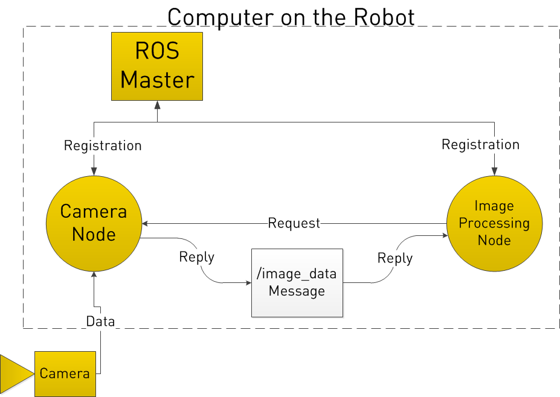
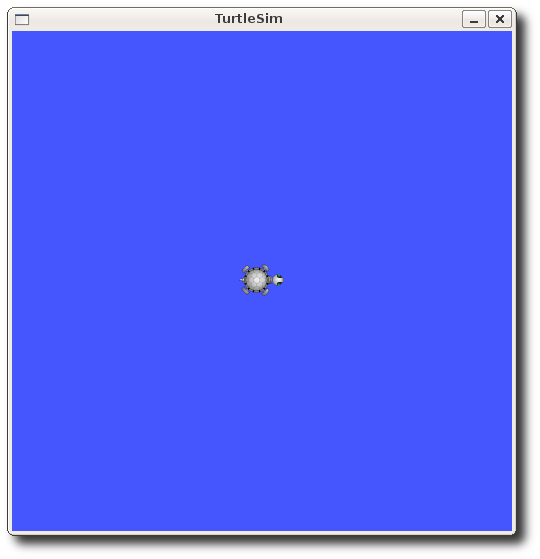

# ROS Tutorial

This tutorial has been extracted from the following references:
- http://wiki.ros.org/ROS/Tutorials
- http://www.clearpathrobotics.com/assets/guides/kinetic/ros/
- ROS free course in Udemy: https://www.udemy.com/share/101GMwAEITeFhTRX4F/
- ROS Course Anis Koubaa: https://www.udemy.com/ros-essentials/
- ROS course Edouard Renard: https://www.udemy.com/share/1022ucAEITeFhTRX4F/
- ROS course: https://github.com/PacktPublishing/Hands-On-ROS-for-Robotics-Programming

Important repositories from TheConstruct and other tutorials:
https://bitbucket.org/theconstructcore/workspace/projects/

# What is ROS?

Robot Operating System (ROS) is an open source software environment used worldwide to program in robotics. 

Its development started at Willow Garage, a technology incubator and robotics research laboratory in Stanford University. 
- Its origin dates back to several projects at Stanford University from the mid-2000s, where researchers found themselves reinventing the wheel every time they had to build the software for each project. 
- In 2007, Willow Garage took the lead and gave rise to ROS. The main goal was to reuse existing code and make it possible to prototype new robot designs quickly, focusing on high-level functionality and minimizing the need for editing code.
- ROS is intended for the development of applications where different devices have to talk to each other in order to create a flexible and scalable environment.
- A ROS system is comprised of a number of independent nodes, each of which communicates with the other nodes using a publish/subscribe messaging model. For example, a particular sensor’s driver might be implemented as a node, which publishes sensor data in a stream of messages. These messages could be consumed by any number of other nodes, including filters, loggers, and also higher-level systems such as guidance, pathfinding, etc.
- Note that nodes in ROS do not have to be on the same system (multiple computers) or even of the same architecture! You could have a Arduino publishing messages, a laptop subscribing to them, and an Android phone driving motors. This makes ROS really flexible and adaptable to the needs of the user. ROS is also open source, maintained by many people.

# General Concepts

Let’s look at the ROS system from a very high level view. No need to worry how any of the following works, we will cover that later.

ROS starts with the ROS Master. The Master allows all other ROS pieces of software (Nodes) to find and talk to each other. That way, we do not have to ever specifically state “Send this sensor data to that computer at 127.0.0.1. We can simply tell Node 1 to send messages to Node 2.


How do Nodes do this? By publishing and subscribing to Topics.

Let’s say we have a camera on our Robot. We want to be able to see the images from the camera, both on the Robot itself, and on another laptop.

In our example, we have a Camera Node that takes care of communication with the camera, a Image Processing Node on the robot that process image data, and a Image Display Node that displays images on a screen. To start with, all Nodes have registered with the Master. Think of the Master as a lookup table where all the nodes go to find where exactly to send messages.


In registering with the ROS Master, the Camera Node states that it will Publish a Topic called /image_data (for example). Both of the other Nodes register that they are Subscribed to the Topic /image_data.

Thus, once the Camera Node receives some data from the Camera, it sends the /image_data message directly to the other two nodes. (Through what is essentially TCP/IP)


Now you may be thinking, what if I want the Image Processing Node to request data from the Camera Node at a specific time? To do this, ROS implements Services.

A Node can register a specific service with the ROS Master, just as it registers its messages. In the below example, the Image Processing Node first requests /image_data, the Camera Node takes data from the Camera, and then sends the reply.



# ROS nodes and topics with Turtlesim 

In order to understand the ROS environment, with nodes, topics and communication between nodes is very interesting to see the Turtlesim exemple.

This tutorial has been extracted from: 
 - http://wiki.ros.org/turtlesim
 - http://wiki.ros.org/ROS/Tutorials/UnderstandingTopics

Be sure you have installed the turtlesim package and run it:

```shell
roscore
roscd turtlesim
rosrun turtlesim turtlesim_node
```


