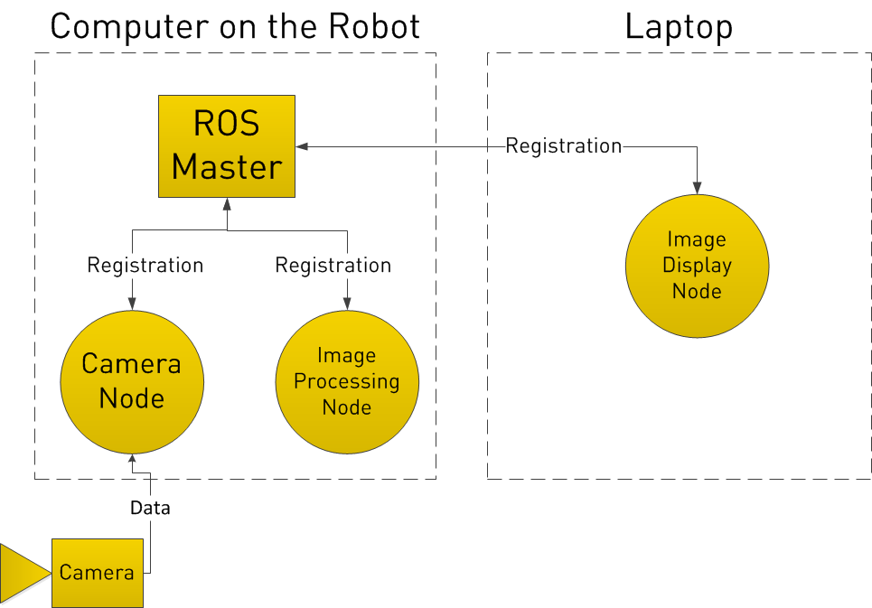
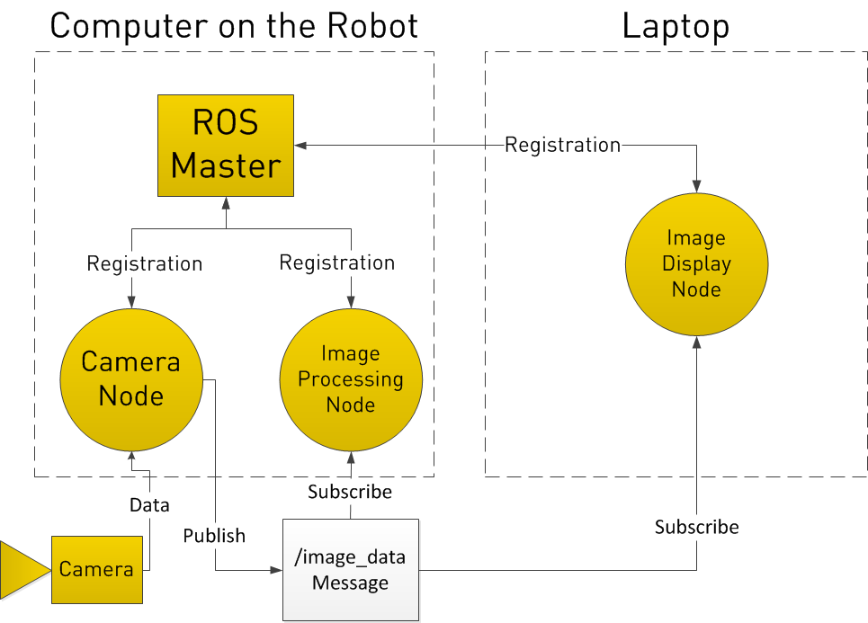
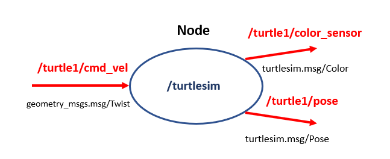
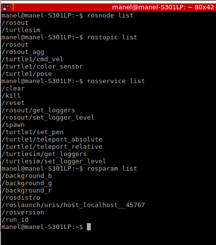
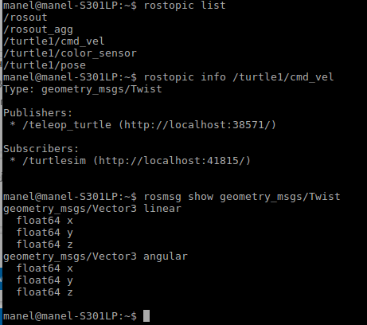
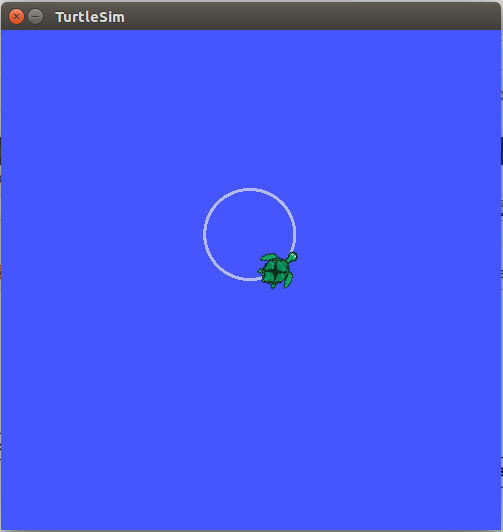
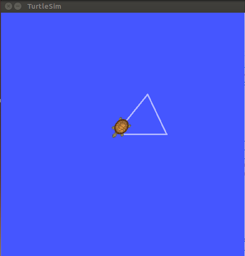
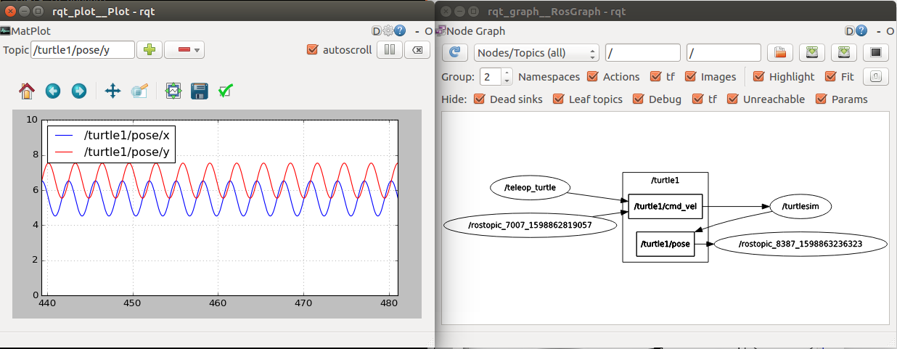
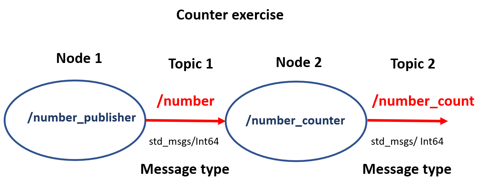

# ROS Tutorial

This tutorial has been extracted from the following references:
- http://wiki.ros.org/ROS/Tutorials
- https://sir.upc.edu/projects/rostutorials/index.html
- http://www.clearpathrobotics.com/assets/guides/kinetic/ros/
- ROS free course in Udemy: https://www.udemy.com/share/101GMwAEITeFhTRX4F/
- ROS Course Anis Koubaa: https://www.udemy.com/ros-essentials/
- ROS course Edouard Renard: https://www.udemy.com/share/1022ucAEITeFhTRX4F/
- ROS course: https://github.com/PacktPublishing/Hands-On-ROS-for-Robotics-Programming

Important repositories from TheConstruct and other tutorials:
https://bitbucket.org/theconstructcore/workspace/projects/

## **1. What is ROS?**

**Robot Operating System (ROS)** is an open source software environment used worldwide to program in robotics. 

Its development started at **Willow Garage**, a technology incubator and robotics research laboratory in Stanford University. 
- Its origin dates back to several projects at Stanford University from the mid-2000s, where researchers found themselves reinventing the wheel every time they had to build the software for each project. 
- In **2007**, Willow Garage **starts ROS environment development**. The main goal was to **reuse existing code** and make it possible to **prototype new robot designs quickly**, focusing on high-level functionality and minimizing the need for editing code.
- ROS is useful for **applications where different devices have to talk to each other** in order to create a flexible and scalable environment.
- A **ROS system** is comprised of a number of independent **nodes**, each of which **communicates** with the other nodes using a **publish/subscribe messaging model**. For example, a particular sensor’s driver might be implemented as a node, which publishes sensor data in a stream of messages. These messages could be consumed by any number of other nodes, including filters, loggers, and also higher-level systems such as guidance, pathfinding, etc.
- Note that **nodes in ROS** do not have to be on the same system (multiple computers) or even of the same architecture! You **could have a Arduino publishing messages, a laptop subscribing to them, and an Android phone driving motors**. This makes ROS really flexible and adaptable to the needs of the user. **ROS is also open source, maintained by many people**.

## **2. ROS General Concepts**

Let’s look at the **ROS system from a very high level view**. No need to worry how any of the following works, we will cover that later.

ROS starts with the **ROS Master**. The Master allows all other ROS pieces of software **(Nodes) to find and talk to each other**. That way, we do not have to ever specifically state “Send this sensor data to that computer at 127.0.0.1". We can simply tell Node 1 to send messages to Node 2.


How do Nodes do this? The **communication is ensured by publishing and subscribing messages to Topics**.

Let’s say we have a camera on our Robot. We want to be able to see the images from the camera, both on the Robot itself, and on another laptop.

**In our example**, we have a **Camera Node that takes care of communication with the camera**, a **Image Processing Node, the communication with the robot** that process image data, and a **Image Display Node that displays images on a laptop screen**. To start with, all Nodes have registered with the Master. Think of the Master as a lookup table where all the nodes go to find where exactly to send messages.



In **registering with the ROS Master**, the **Camera Node can Publish Images in a Topic called /image_data** (for example). Both of the **other Nodes can Subscribe to the Topic /image_data to read the images**.

Thus, **once the Camera Node receives some data from the Camera, it sends the /image_data message directly to the other two nodes**. (Through what is essentially TCP/IP)



Now you may be thinking, what if I want the Image Processing Node to request data from the Camera Node at a specific time? To do this, ROS implements Services.

A Node can register a specific service with the ROS Master, just as it registers its messages. In the below example, the Image Processing Node first requests /image_data, the Camera Node takes data from the Camera, and then sends the reply.


**Main benefits of ROS**
- Create the **base layer** super fast
- provide a **standard** for robotics applications
- use on **any robot**
- allows you to **avoid reinventing the wheel**
- open source community
- plug & play packages


## **3. ROS nodes and topics with Turtlesim**

In order **to understand the ROS environment, with nodes, topics and communication** between nodes is very interesting to see the **Turtlesim exemple**.

This tutorial has been extracted from: 
 - http://wiki.ros.org/turtlesim
 - http://wiki.ros.org/ROS/Tutorials/UnderstandingTopics

Be sure you have installed the turtlesim package and run it:

```shell
roscore
rosrun turtlesim turtlesim_node
```


"turtlesim_node" is a node responsible to spawn the turtle in the blue board



To **list the nodes and topics**, type:
```shell
rosnode list
rostopic list
```


To see the **information about the nodes, topics and messages**, type:

```shell
rosnode info /turtlesim
rostopic info /turtle1/cmd_vel
rostopic info /turtle1/pose
```
In order **to see the message structure**, type:
```shell
rosmsg show geometry_msgs/Twist
rosmsg show turtlesim/Pose 
```


you can also find the message structure in google: http://docs.ros.org/melodic/api/geometry_msgs/html/msg/Twist.html

In order **to write a message to a topic** we have different options:
- we can **publish directly to the topic**: for exemple to publish a Twist type message with a rate of 1Hz to define a circle, type:

```shell
rostopic pub -r 1 /turtle1/cmd_vel geometry_msgs/Twist '[2, 0, 0]' '[0, 0, 2]'
```



- or we can write a node to **use the keyboard arrows** to generate and publish the cmd_vel messages to the /cmd_vel topic:
```shell
rosrun turtlesim turtle_teleop_key
```


"turtle_teleop_key" is another node responsible to comand and move the turtle.

In order **to listen a message from a topic**:
```shell
rostopic echo /turtle1/pose
rostopic echo /turtle1/cmd_vel
```

We can use "rqt_graph" and "rqt_plot" to se the nodes-topics structure and the message values

```shell
rqt_graph
rqt_plot
```




> Note in ROS for windows: you need to install graphviz and add to the PATH for all users, to properly see rqt_graph: https://graphviz.org/download/

## **4. Create new ROS Packages**

To program any functionality in ROS environment we need to create a Package.

For this first course in ROS, all the needed packages are already created.

The procedure followed to create a package, its sintax and all the information is described in: http://wiki.ros.org/ROS/Tutorials/WritingPublisherSubscriber%28python%29

The needed steps to create a "ros_basics" package are:
```shell
cd /home/rUBot_tutorial_ws/src
catkin_create_pkg ros_basics std_msgs rospy
cd /home/rUBot_tutorial_ws
catkin_make
```
### **4.1. ROS Publishers and Subscribers**

In order to generate a node to Publish and/or Subscribe in a topic/s, we can create a python file in script folder in "ros_basics" package.

As a "talker-listener" exemple, we will show first graphically a "talker" and "listener" nodes, a "chatter" topic and the String type messages created for communication purposes:


Here a python publisher node is defined to:
- create a "talker" node
- publish a String type message 
- in a /chatter topic
- with a rate of 10Hz

The syntaxis code in python is:
```python
#!/usr/bin/env python3
import rospy
from std_msgs.msg import String

def talker():
    rospy.init_node('talker', anonymous=True)
    pub = rospy.Publisher('chatter', String, queue_size=10)
    rate = rospy.Rate(10) # 10hz
    while not rospy.is_shutdown():
        hello_str = "hello world %s" % rospy.get_time()
        rospy.loginfo(hello_str)
        pub.publish(hello_str)
        rate.sleep()

if __name__ == '__main__':
    try:
        talker()
    except rospy.ROSInterruptException:
        pass
```
Also another python subscriber node is defined to:
- create a "listener" node
- subscribe to the /chatter topic 
- a message of String type (from std_msgs package) 
- When new messages are received, callback is invoked with the message as the first argument

The syntaxis code in python is:

```python
#!/usr/bin/env python3
import rospy
from std_msgs.msg import String

def callback(data):
    rospy.loginfo(rospy.get_caller_id() + "I heard %s", data.data)
    
def listener():
    rospy.init_node('listener', anonymous=True)
    rospy.Subscriber("chatter", String, callback)
    rospy.spin()

if __name__ == '__main__':
    listener()
```
### **Exercise: Doubled**
Create a "doubler" node that:
- subscribes to a /number topic
- calculates the double of the number read in /number topic
- publishes the result in /doubled topic


The python code is represented in "doubler.py"
```python
#!/usr/bin/env python3
import rospy
from std_msgs.msg import Int32

def callback(msg):
    doubled = Int32()
    doubled.data = msg.data * 2
    pub.publish(doubled)

rospy.init_node('doubler')
sub = rospy.Subscriber('number', Int32, callback)
pub = rospy.Publisher('doubled', Int32, queue_size=10)
rospy.spin()
```
Carefull!:
Be sure that the python editor has "End of Line sequence" selected to LF (right-bottom section in VS Code)

To verify the program, we have to publish a number in /number topic and subscibe to the /doubled topic using different terminals:
```shell
roscore
rosrun ros_basics doubler.py
rostopic echo /doubled
rostopic pub /number std_msgs/Int32 2
rqt_graph
```
With ROS_windows you need to create a "counter.launch" file to properly run the application:
```xml
<?xml version="1.0" encoding="UTF-8"?>
<launch>
    <node pkg="ros_basics" type="doubler.py" name="doubler" output="screen" />
</launch>
```
Type:
```shell
roslaunch ros_basics doubler.launch
rostopic echo /doubled
rostopic pub /number std_msgs/Int32 2
rqt_graph
```


### **Exercise: Counter**
In this exercise, we develop python scripts to perform the following functionalities.
- Publish a number every 1s
- Read this number, adds with the previous one and publishes the result

Graphically is represented by:


Create in  the "script" folder the python file "publisher_num.py" for the Publiser:
```python
#!/usr/bin/env python3
import rospy
from std_msgs.msg import Int64

rospy.init_node("number_publisher", anonymous=True)
pub = rospy.Publisher("/number", Int64, queue_size=10)
rate = rospy.Rate(1)

while not rospy.is_shutdown():
	msg = Int64()
	msg.data = 2
	pub.publish(msg)
	rate.sleep()
```
Do not forget to make the file executable: chmod +x Publisher_num.py

In "script" folder create the python file "pubsub_counter.py" for the Publiser/Subscriber:
```python
#!/usr/bin/env python3
import rospy
from std_msgs.msg import Int64

counter = 0

def callback_number(msg):
	global counter
	counter += msg.data
	new_msg = Int64()
	new_msg.data = counter
	pub.publish(new_msg)
	rospy.loginfo("I Publish the counter value: %s", counter)

rospy.init_node('number_counter')
pub = rospy.Publisher("/number_count", Int64, queue_size=10)
sub = rospy.Subscriber("/number", Int64, callback_number)
rospy.spin()
```
Do not forget to make the file executable: 
- chmod +x pubsub_counter.py

These python scripts can be adapted to the desired control functions.

To properly run the ROS application, create a launch folder containing the "counter.launch" file:
```xml
<?xml version="1.0" encoding="UTF-8"?>

<launch>
    <node pkg="ros_basics" type="publisher_num.py" name="number_publisher"/>
    <node pkg="ros_basics" type="pubsub_counter.py" name="number_counter" output="screen" />
</launch>
```
To launch the exercise, type:
```shell
roslaunch ros_basics counter.launch
rqt_graph
```


### **Exercise**
Let's program 2 ping-pong nodes according to this graph, with the functionality:
- ping_node publish a word every 1s
- if this word is "Ping", pong_node that is subscribing the ping topic answers "Pong" in other case answers "Failed!"


To verify the ping-pong program, type:
```shell
roslaunch ros_basics ping_pong.launch
```
