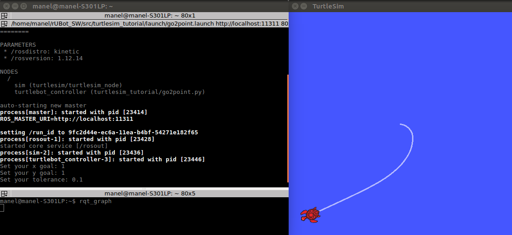
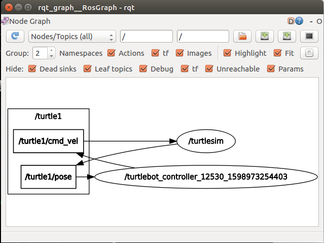

# **ROS Tutorial Turtlesim Script Programming**
Let's now create our proper Turtlesim package with different python nodes to perform simple navigation control exemples of Turtlesim robot.

This tutorial has been extracted from the following references:
- http://wiki.ros.org/ROS/Tutorials
- http://www.clearpathrobotics.com/assets/guides/kinetic/ros/
- ROS free course in Udemy: https://www.udemy.com/share/101GMwAEITeFhTRX4F/
- ROS Course Anis Koubaa: https://www.udemy.com/ros-essentials/
- ROS course Edouard Renard: https://www.udemy.com/share/1022ucAEITeFhTRX4F/

## **Navigation control of Turtlesim**
A specific package "turtlesim_tutorial" is created where different motion control programs will be done.

Within this package, a node "/move_turtle" can be created to command the "/turtlesim" node.

This node is created in order to perform a speciffic motion control function:
- publishes in the /turtle1/cmd_vel topic 
- subscribes to the /turtle1/pose topic

This is performed following the tutorial:
- http://wiki.ros.org/turtlesim/Tutorials
- http://wiki.ros.org/turtlesim/Tutorials#Practicing_Python_with_Turtlesim
- http://wiki.ros.org/turtlesim/Tutorials/Go%20to%20Goal
- https://github.com/Apress/Robot-Operating-System-Abs-Begs


We remind you how to create a "turtlesim_tutorial" package with dependencies (rospy, geometry_msgs, turtlesim)

In src directory:
```shell
cd src
catkin_create_pkg turtlesim_tutorial rospy geometry_msgs turtlesim
cd ..
catkin_make
```
We have also created a folder "scripts" where we have placed python programs for speciffic motion control functions. 

Let's perform different exercises to understand how to programm the motion control functions in ROS environment.

### **Exercise: Move distance with turtlesim**
Develop a python script to perform the following functionalities.
- Specify a distance in x direction for turtlesim to move
- Read the Pose of turtlesim
- if the Pose.x is lower than the the distance specified, publish linear and angular speed
- if the Pose.x is higher, then stop


Create in "scripts" folder the python file "move_distance.py"

make the file executable, and type in a terminal:
```shell
roscore
rosrun turtlesim turtlesim_node
rosrun turtlesim_tutorial move_distance.py 0.4 0.0 7.0
```


When using ROS_windows, we have to generate a launch file "move_distance.launch" to run all nodes:
```xml
<?xml version="1.0" encoding="UTF-8"?>

<launch>
    <arg name="v" default="0.7"/>
    <arg name="w" default="0"/>
    <arg name="d" default="7"/>
    <param name="v" value="$(arg v)"/>
    <param name="w" value="$(arg w)"/>
    <param name="d" value="$(arg d)"/>
    <node pkg="turtlesim" type="turtlesim_node" name="turtlesim_node"/>
    <node pkg="turtlesim_tutorial" type="move_distance_params.py" name="move_turtle" output="screen" />
</launch>
```
We have created here a new "move_distance_params.py" script to introduce the parameters in the python script:

```python
#!/usr/bin/env python3
import rospy
from geometry_msgs.msg import Twist
from turtlesim.msg import Pose
import sys

robot_x = 0

def pose_callback(pose):
	global robot_x
	rospy.loginfo("Robot X = %f\n",pose.x)
	robot_x = pose.x

def move_turtle(lin_vel,ang_vel,distance):
    global robot_x
    rospy.init_node('move_turtle', anonymous=False)
    pub = rospy.Publisher('/turtle1/cmd_vel', Twist, queue_size=10)
    rospy.Subscriber('/turtle1/pose',Pose, pose_callback)
    rate = rospy.Rate(10) # 10hz
    vel = Twist()
    while not rospy.is_shutdown():
        vel.linear.x = lin_vel
        vel.linear.y = 0
        vel.linear.z = 0
        vel.angular.x = 0
        vel.angular.y = 0
        vel.angular.z = ang_vel
 
        if(robot_x >= distance):
            rospy.loginfo("Robot Reached destination")
            rospy.logwarn("Stopping robot")
            break
        pub.publish(vel)
        rate.sleep()

if __name__ == '__main__':
    try:
        v= rospy.get_param('v')
        w= rospy.get_param('w')
        d= rospy.get_param('d')
        move_turtle(v,w,d)
    except rospy.ROSInterruptException:
        pass
```
To execute it, type:
```shell
roslaunch turtlesim_tutorial move_distance.launch
```
### **Exercise: Go to target point with turtlesim**
Develop a ROS node to perform the following functionalities.
- Specify a target point (x,y) with a tolerance for turtlesim to move
- Read the Pose of turtlesim
- if the turtlesim Position is far from the point, publish linear and angular speed
- if is close within the tolerance, stop


We can do better!

We can program in Object Oriented Programming, creating a python Class and use input parameters to specify the target point and tolerance

Object Oriented Programming (OOP) is everywhere in python. 
- OOP is a way to organize your code into Classes. 
- A Class a sort of container of objects with a set of attributes (variables/properties) and methods (functions)

Create a file go2point.py

```python
#!/usr/bin/env python3
import rospy
from geometry_msgs.msg import Twist
from turtlesim.msg import Pose
from math import pow, atan2, sqrt


class TurtleBot:

    def __init__(self):# first you need to define a constructor to initialize the class attributes. "self" relates an object of the class TurtleBot
        # Creates a node with name 'turtlebot_controller' and make sure it is a
        # unique node (using anonymous=True).
        rospy.init_node('turtlebot_controller', anonymous=True)

        # Publisher which will publish to the topic '/turtle1/cmd_vel'.
        self.velocity_publisher = rospy.Publisher('/turtle1/cmd_vel',
                                                  Twist, queue_size=10)

        # A subscriber to the topic '/turtle1/pose'. self.update_pose is called
        # when a message of type Pose is received.
        self.pose_subscriber = rospy.Subscriber('/turtle1/pose',
                                                Pose, self.update_pose)

        self.pose = Pose()
        self.rate = rospy.Rate(10)

    def update_pose(self, data): # all defined methods (functions) have to be linked (related) to the objects of the class
        """Callback function which is called when a new message of type Pose is
        received by the subscriber."""
        self.pose = data
        self.pose.x = round(self.pose.x, 4)
        self.pose.y = round(self.pose.y, 4)

    def euclidean_distance(self, goal_pose):# is the distance from the robot to the goal
        """Euclidean distance between current pose and the goal."""
        return sqrt(pow((goal_pose.x - self.pose.x), 2) +
                    pow((goal_pose.y - self.pose.y), 2))

    def linear_vel(self, goal_pose, constant=1.5):# proportional to the goal distance
        """See video: https://www.youtube.com/watch?v=Qh15Nol5htM."""
        return constant * self.euclidean_distance(goal_pose)

    def steering_angle(self, goal_pose): # is the angle of the stright line from the robot to the goal
        """See video: https://www.youtube.com/watch?v=Qh15Nol5htM."""
        return atan2(goal_pose.y - self.pose.y, goal_pose.x - self.pose.x)

    def angular_vel(self, goal_pose, constant=6):# proportional to the difference between the steering angle amb the robot orientation
        """See video: https://www.youtube.com/watch?v=Qh15Nol5htM."""
        return constant * (self.steering_angle(goal_pose) - self.pose.theta)

    def move2goal(self): # all defined methods (functions) have to be linked (related) to the objects of the class then the first parameter has to be self
        """Moves the turtle to the goal."""
        goal_pose = Pose()

        # Get the input from the user.
        goal_pose.x = input("Set your x goal: ")
        goal_pose.y = input("Set your y goal: ")

        # Please, insert a number slightly greater than 0 (e.g. 0.01).
        distance_tolerance = input("Set your tolerance: ")

        vel_msg = Twist()

        while self.euclidean_distance(goal_pose) >= distance_tolerance:

            # Porportional controller.
            # https://en.wikipedia.org/wiki/Proportional_control

            # Linear velocity in the x-axis.
            vel_msg.linear.x = self.linear_vel(goal_pose)
            vel_msg.linear.y = 0
            vel_msg.linear.z = 0

            # Angular velocity in the z-axis.
            vel_msg.angular.x = 0
            vel_msg.angular.y = 0
            vel_msg.angular.z = self.angular_vel(goal_pose)

            # Publishing our vel_msg
            self.velocity_publisher.publish(vel_msg)

            # Publish at the desired rate.
            self.rate.sleep()

        # Stopping our robot after the movement is over.
        vel_msg.linear.x = 0
        vel_msg.angular.z = 0
        self.velocity_publisher.publish(vel_msg)

        # If we press control + C, the node will stop.
        rospy.spin()

if __name__ == '__main__':
    try:
        x = TurtleBot()
        x.move2goal()
    except rospy.ROSInterruptException:
        pass
```
We can write a "go2point.launch" launch file to setup all needed nodes:
```xml
<?xml version="1.0" encoding="UTF-8"?>

<launch>
    <node pkg="turtlesim" type="turtlesim_node" name="turtlesim_node"/>
    <node pkg="turtlesim_tutorial" type="go2point.py" name="turtlebot_controller" output="screen" />
</launch>
```
To execute, type:
```shell
roslaunch turtlesim_tutorial go2point.launch
```



## **Proposed Exercise: Go to Target position and orientation**

The objective is to reach the desired position with the proper orientation also.

We will create a new python script to reach first the position and later the orientation